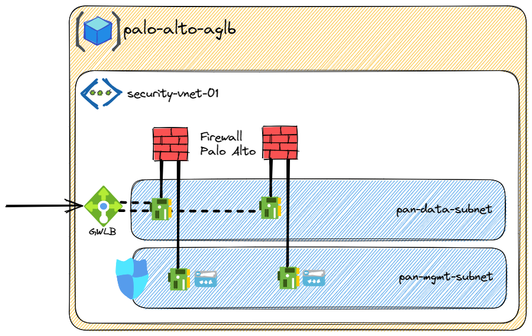

# Terraform Azure Gateway Load Balancer with Palo Alto VM firewall

## Overview
This project provides some Terraform scripts to deploy a ressource group with Azure Gateway Load Balancer configured to use Palo Alto VM firewall as backend.  

Gateway Load Balancer is a SKU of the Azure Load Balancer portfolio catered for high performance and high availability scenarios with third-party Network Virtual Appliances (NVAs). With the capabilities of Gateway Load Balancer, you can easily deploy, scale, and manage NVAs. Chaining a Gateway Load Balancer to your public endpoint only requires one selection.



# Implementation

## Requirements
You will need to install : 
* [Terraform](https://www.terraform.io/downloads.html) (tested with version v1.4.5)
* Terraform Providers (installed using command *terraform init*): 
  * azurerm (tested with version v3.52.0)
  * random (tested with version v3.5.1)
* Terraform modules: 
  * [Terraform Modules for Palo Alto Networks VM-Series on Azure Cloud](https://registry.terraform.io/modules/PaloAltoNetworks/vmseries-modules/azurerm/0.5.5)

## Quickstart
To deploy Azure Gateway Load Balancer you will have to customize variables.tf file : 
* allow_inbound_mgmt_ips variable list must contain public IPs that must be able to manage firewalls. You can get your public IP using the command : `curl ifconfig.me`
* other variables have some default values but can be customize according to your needs

````
> terraform init
> terraform plan
> terraform apply
````

````
Apply complete! Resources: 31 added, 0 changed, 0 destroyed.

Outputs:

paloalto_password = <sensitive>
paloalto_username = "panadmin"
paloalto_vmseries_01_dns = "https://fwvm-01-mgmt-xxx.westeurope.cloudapp.azure.com"
paloalto_vmseries_02_dns = "https://fwvm-02-mgmt-xxx.westeurope.cloudapp.azure.com"
````

If you let the script randomly generate the password you can retrieve the password using : `terraform output paloalto_password`.  
The firewall can take several minutes after the terraform is finished to complet the bootstrap and the initial configuration. 

# Useful links
- [Gateway Load Balancer Overview](https://learn.microsoft.com/en-us/azure/load-balancer/gateway-overview)
- [Deploy the VM-Series with the Azure Gateway Load Balancer - Palo Alto documentation](https://docs.paloaltonetworks.com/vm-series/11-0/vm-series-deployment/set-up-the-vm-series-firewall-on-azure/deploy-the-vm-series-firewall-with-the-azure-gwlb)
